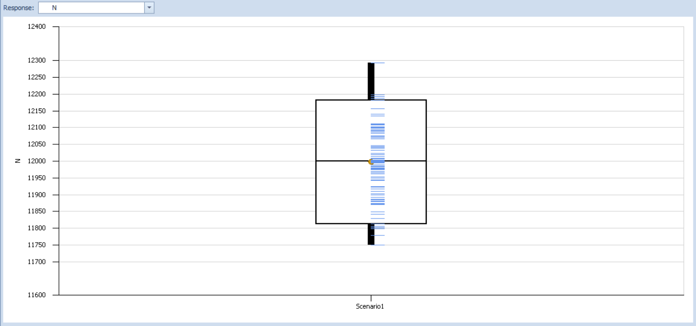
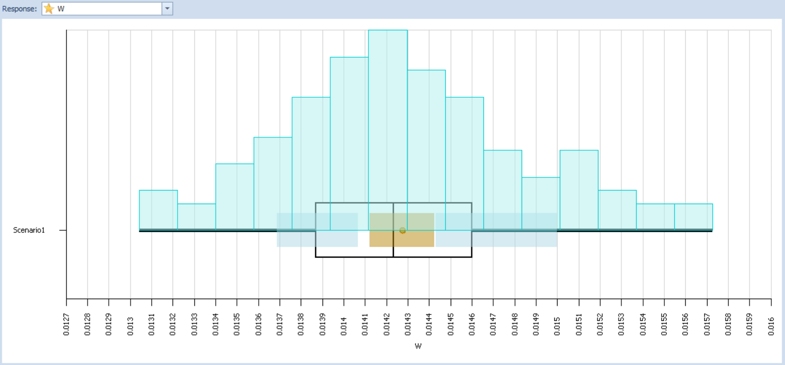
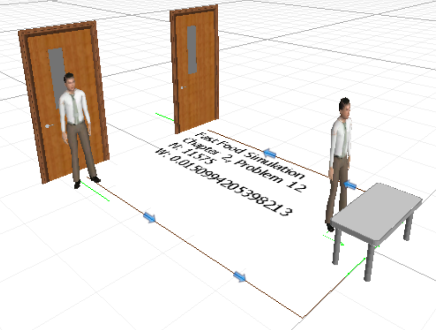

```{r setup, include=FALSE}
knitr::opts_chunk$set(message=FALSE, warning=FALSE, fig.align='center')
```


## Chapter 2, Problem 2
For an $M/M/1$ system with $\lambda$ = 120 entities per hour and $\mu$ = 190 entities per hour, the steady-state time in the system $W$ can be computed:
$$W = \frac{L}{\lambda} = \frac{1}{\mu - \lambda} = 
\frac{1}{190 - 120} = 0.1429$$

So the steady-state time in the system is 0.1429 hours (equal to 0.8571 minutes or 51.4286 seconds).

Using this value, the number of entities processed in 100 hours can be solved 
$$N = \frac{100}{W} = \frac{100}{0.1429} = 7000$$

It is expected that at a steady state, 7000 entities will be processed in 100 hours.


## Chapter 2, Problem 3
Running an experiment of 100 replications with run time of 100 hours plus warm-up period of 20 hours, the following SMORE plots are created for the response variables $N$ (`DefaultEntity.Population.NumberDestroyed`) and $W$ (`DefaultEntity.Population.TimeInSystem.Average`):



This boxplot with observation indicators shows that the number $N$ of entities destroyed in the system varies from roughly 11,750 to 12,300, with the 5th and 95th percentiles lying at roughly 11,810 and 12,190, respectively.  These numbers are considerably larger than the theoretical $N = 7000$ calculated above.



This rotated plot with added histogram and confidence intervals shows behavior similar to what is expected for the time $W$ in the system.  The distribution of results is approximately normally distributed about the median value.  The mean value appears approximately equal to the calculated steady state value of $W = 0.01429$; the 99% confidence interval has a half-width of roughly 0.00015 hours.


## Chapter 2, Problem 9
The model from Problem 1 was recreated using processes:


An experiment of 50 replications of 100 hours (with no warm-up period) was run for this process-based model, as well as for the original model created using the standard library.  The results of these experiments are presented below.  $W$ is the total time in system; $N$ is the number of entities passing through the system; $t$ is the time taken to run the experiment.  All time values are in seconds.

```{r p9-tbl, echo=FALSE}
W <- c('$51.5892 \\pm 0.5888$', '$51.5892 \\pm 0.5888$')
N <- c('$1194.62 \\pm 32.5516$', '$1194.62 \\pm 32.5516$')
t <- c(6.5, 30.0)

df <- data.frame(W, N, t, row.names = c('Process', 'Library'), check.names = FALSE)
names(df) <- c('$W$', '$N$', '$t$')
pander::pander(df)
```

The table above shows that the two models yielded **identical results**, but the model using processes accomplished the results in less than 25% of the time (as measured roughly by a stopwatch).  This clearly demonstrates the benefit of building models based on processes -- the greater computational speed allows for cheaper simulation of the same quality.


\newpage
## Chapter 2, Problem 12
Using animated people for the model entity, setting up a floor label to track the values of $W$ and $N$ explored earlier, and running the model in 3D, the image below is generated.  The model prepared is also included as *Problem12* in the Simio workbook included with this assignment.


