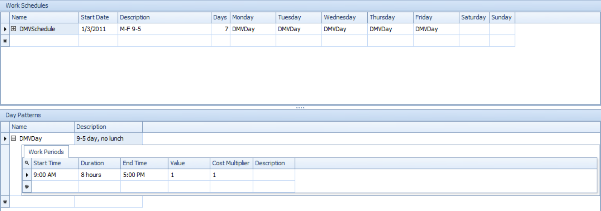
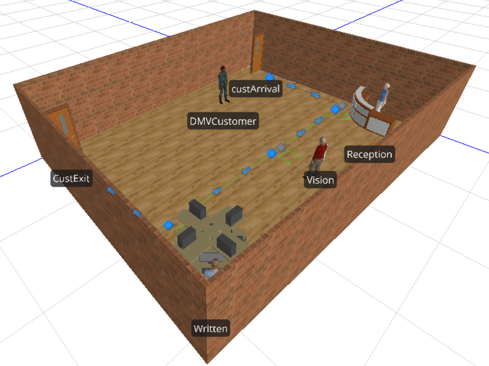

```{r setup, include=FALSE}
knitr::opts_chunk$set(message=FALSE, warning=FALSE, fig.align='center')
```


## Problem 1
Object properties dictate the behavior of an object, including things like mean inter-arrival or service time for model entities.  They can not be changed during the running of a model.  Object states indicate characteristics of an object at a given point in time, possibly including things like customers served or utilization.  States often change during modeling, and can be edited while a model is running.


## Problem 2
The token's parent object is an instance of object in which the token is currently going through the process -- in this case, the process associated with the Server object.  The associated object is the object that triggered the process associated with the Server -- in this case, the model entity, which generated the entry of the token into the Server process.


## Problem 3
The interarrival time at the placement server is $\lambda_p = 10$.  Since all of the PCBs entering the placement station go to the inspection station, $\lambda_i = \lambda_p$.  Using the mean or mode for the two server stations, their values are $\mu_p = 15$, $\mu_i = 20$.

Using these values, the utilizations can be solved:
$$\begin{array}{cc}
\rho_p = \frac{\lambda_p}{\mu_p} & \rho_i = \frac{\lambda_i}{\mu_i} \\
\rho_p = \frac{10}{15} & \rho_i = \frac{10}{20} \\
\rho_p = 0.667 & \rho_i = 0.5
\end{array}$$

Since each of the servers represents an $M/M/1$ system, the values of $L$ can be calculated:
$$\begin{array}{cc}
L_p = \frac{\lambda}{\mu_p-\lambda} & L_i = \frac{\lambda}{\mu_i - \lambda}\\
L_p = \frac{10}{15 - 10} & L_i = \frac{10}{20-10} \\
L_p = 2 & L_i = 1
\end{array}$$

So the total number in the system is $$L = L_p + L_i = 3$$

Little's Law can be applied to calculate the time in the system:
$$W = \frac{L}{\lambda} = \frac{3}{10} = 0.3$$


## Problems 4 & 5
A model is set up with a source, 3 servers, and a sink, each 15 feet away from one another.  The three servers are set up with the given distributions; the written exam server is set with an initial capacity of 3, to represent the three computer testing stations.

Each of the server entities is set to a work schedule `DMVSchedule`, established as shown below:



The model is animated using downloaded symbols and random symbols for customers from the standard library:



\newpage
An experiment is run with 365 replications of 24 hours each -- this represents a full year.  No startup time is considered since the first 9 hours of each period are off-shift hours.  365 replications yields a reasonably narrow half-width for response estimates.  The results of this experiment are presented below:

```{r echo=FALSE}
library(pander)
res <- matrix(c(
  5.2559, 0.1998,
  0.0211, 0.0010,
  0.0106, 0.0005,
  0.0434, 0.0020,
  0.8245, 0.0334,
  0.0000, 0.0000,
  0.0161, 0.0020,
  2.5671, 0.1125,
  1.0000, 0.0000,
  1.4027, 0.0601
), ncol = 2, byrow = TRUE)

dimnames(res) <- list(
  c('$W$', '$\\rho_{rec}$', '$\\rho_{vis}$', '$\\rho_{writ}$',
    '$\\bar{L}_{rec}$', '$\\bar{L}_{vis}$', '$\\bar{L}_{writ}$',
    '$max({L}_{rec})$', '$max({L}_{vis})$', '$max({L}_{writ})$'),
  c('Mean', 'Half-Width'))

pander(res)
```

