```{r setup, include=FALSE}
knitr::opts_chunk$set(message=FALSE, warning=FALSE, fig.align='center')
```


## Problem 6
Model 5.2 is established using the fixed weights of 66%, 8%, and 26% for good, bad, and reworked parts, respectively.  To allow for investigation of the overlap of the three shifts, a new schedule (*InspectionOverlap*) is created using a new day pattern (*OverlapDayPattern*):

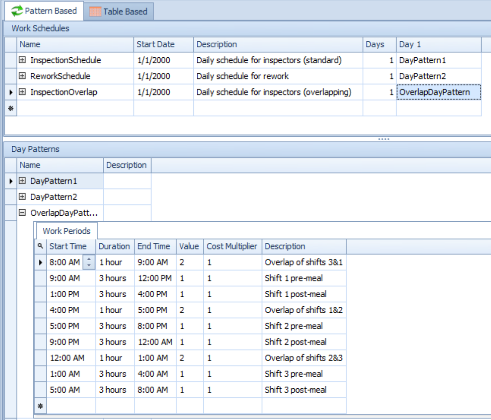

With two schedules now set up for inspection workers, the work schedule for the Inspection server is replaced by a reference to the newly-created reference property *InspectorSchedule*:

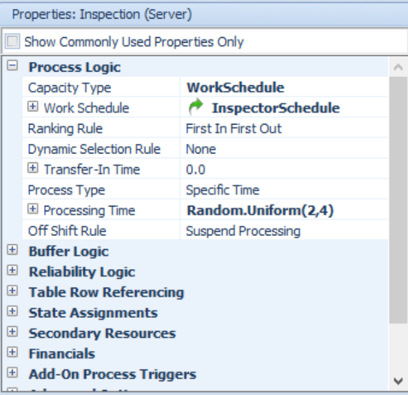

An experiment is then run with two scenarios (one for each schedule) for 25 replications each of 300 days with a 50-day warmup period.  Three responses are created and tracked:

  - TIS: `PCB.Population.TimeInSystem.Average`
  - NIS: `PCB.Population.NumberInSystem.Maximum`
  - TotalNum: `PCB.Population.NumberDestroyed`

The objective of these responses are set to be minimum, minimum, and maximum, respectively.  The results of the experiment, along with SMORE plots, are presented below:

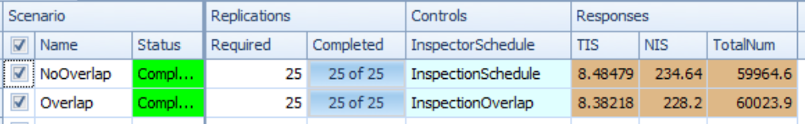
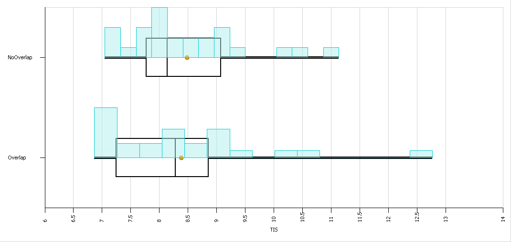
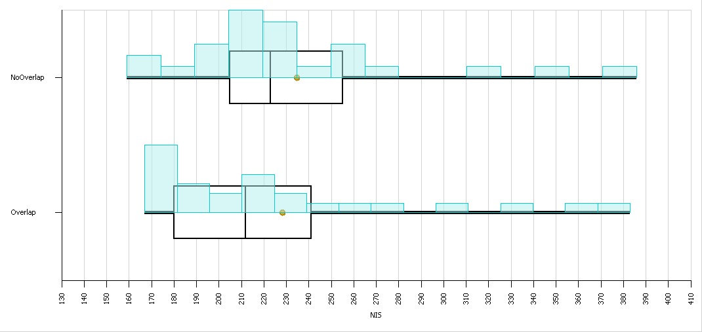
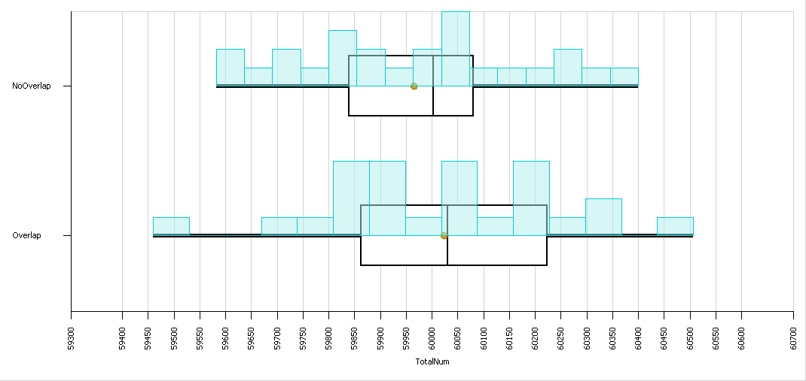

This experiment shows that having the schedules of inspectors does not improves performance of the model.  This makes intuitive sense since the new schedule yields 24 total hours of inspector availability, as opposed to 21 total hours without overlap.


\newpage
## Problem 7
In order to declare parts failing inspection 3 times bad parts, a new discrete entity state, *RepeatFailure*, is created.  A tally statistic, *NumRepeatFailures*, is created in the model to track the number of repeat failures.

To ensure that parts processed 3 times that would have otherwise gone for rework (i.e. failed inspection 3 times) are instead classified as bad parts, a node is added between the Inspection server and the Rework server.  The weight of the connection to this node is 0.26, continuing to reflect that 26% of parts will need reworking.  The outputs of this node are connected to the Rework server and BadParts sink:

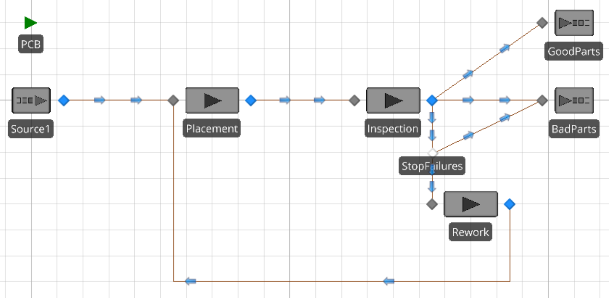

The weights of the connectors to the rework and bad parts are `ModelEntity.TimesProcessed < 3` and `ModelEntity.TimesProcessed == 3`, respectively, and the outbound link rule of the node is set by link weight.  Thus, when a part is sent for rework, it will be reworked if it has been inspected fewer than 3 times, but will automatically be deemed a bad part if it has been processed 3 times.  If the part has been inspected 3 times, the node sets *RepeatFailure* to 1 (true) prior to sending it to the sink.

The add-on process for the input node of the BadParts sink is modified to tally the number of parts deemed bad due to exceeding the number of acceptable inspections:

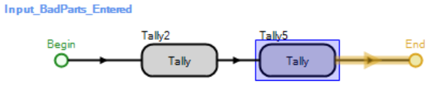

The results of running this model for 300 days are presented below:

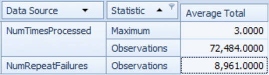

The first row of the pivot grid shows that the model succesfully limited the number of times a part could be inspected to 3.  8,961 of the 72,484 parts processed (12.4%) were rejected due to 3 inspection failures.


\newpage
## Problem 8
As shown for Model 5-2 in the text, the output rate of the placement machine is equal to the incoming rate since $\rho_{placement} < 1$.  This outgoing rate is the incoming rate for the fine-pitch machines:
$$\lambda_{fine} = \lambda^\prime = 1.3514 \lambda = 13.514$$
The expected service times of the three fine-pitch machines can be used to calculate the expected utilzation of the three stations:
$$\begin{aligned}
E(S_{fast}) = 9 \rightarrow \mu_{fast}=6.6667 \rightarrow \rho_{fast} = 2.0271\\
E(S_{med}) = 12 \rightarrow \mu_{fast}=5.0000 \rightarrow \rho_{med} = 2.7028\\
E(S_{slow}) = 14 \rightarrow \mu_{fast}=4.2857 \rightarrow \rho_{fast} = 3.1533
\end{aligned}$$

These utilizations are all greater than one --- all of the machines will have more work than they can complete!  This is why selection of a fine-pitch machine is based on *overload* -- the amount by which the machines' capacities are exceeded.

The fast fine-pitch machine has is subjecto to failures every 3 hours, which take 30 minutes to repair.  This needs to be accounted for, since the utilization of the machine is strictly greater than 1.  Since the machine is only available for 180 of every 210 minutes, the new effective utilization for the fast machine becomes
$$\rho^\prime_{fast} = \rho_{fast} \times \frac{210}{180} = 2.3650$$

Since selection of machines is based on overload at each machine when a part exits the placement machine, a measure of the overload must be generated.  It is reasonable to assume that overload is inversely proportional to utilization:
$$OL_x \propto \frac{1}{\rho_x} \ \ \ \ \forall \ \ \ x \in \{fast, med, slow\}$$

To get the proportion of parts going to each of the machines, the ratio of the individual machine overloads to the total overloads is taken:
$$p_x = \frac{OL_x}{\sum OL} \ \ \ \ \forall \ \ \ x \in \{fast, med, slow\}$$

Substituting in the calculated values of $\rho$ into the prior two equations yields the following results:
$$\begin{array}{c}
p_{fast} = 0.3809\\
p_{med} = 0.3333\\
p_{slow} = 0.2857
\end{array}$$

These match the stated proprtions of 38%, 33%, and 29%.


\newpage
## Problem 9
In order to model the described pharmacy, the following model is designed:

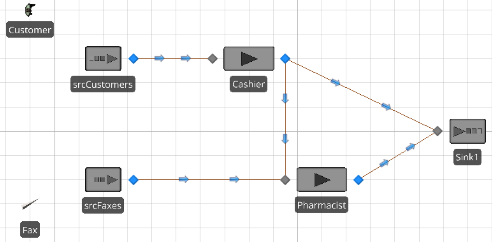

The model has two entities, *Customers* and *Prescriptions* -- these represent customers arriving and prescriptions faxed in, respectively.  Each of the entities has a source object associated with it (*srcCustomers* and *srcFaxes*).  These source objects are each assigned the appropriate entity type.  Rate tables are assigned for each of the types, and the arrival mode is pointed to the appropriate rate table.  These are shown for the *srcCustomers* source below:

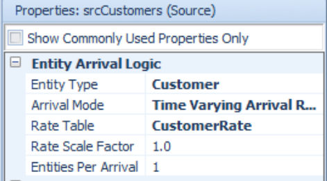 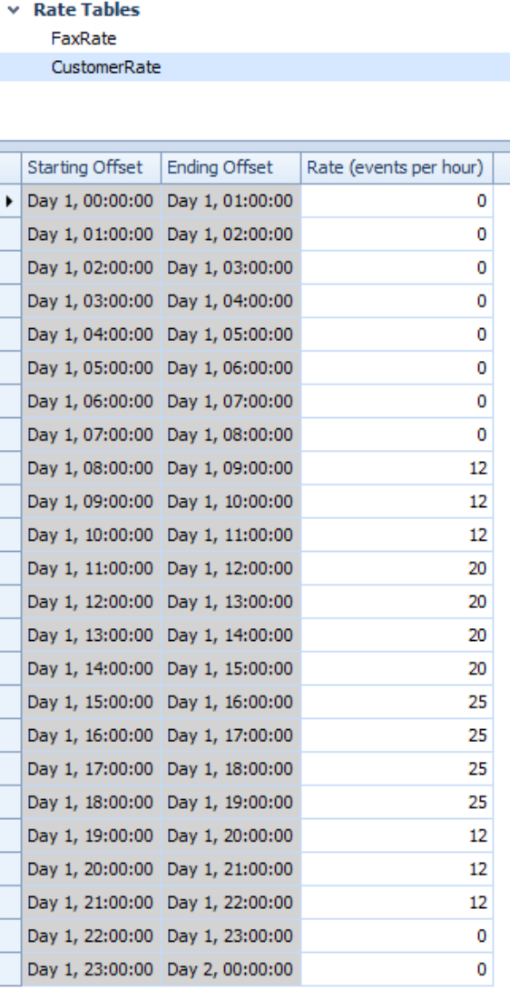

The capacity of the two servers (*Cashier* and *Pharmacist*) are determined based on the given calendar-based schedules, as illustrated below:

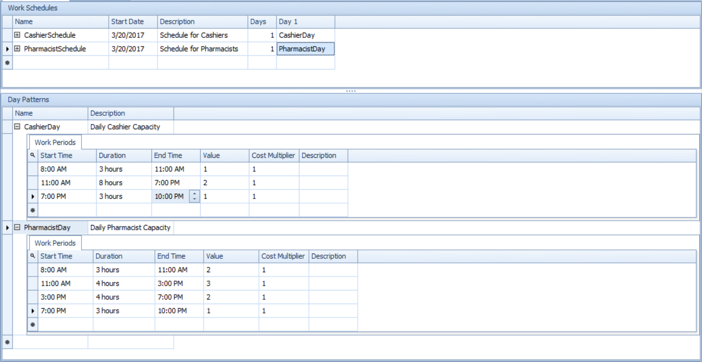

A new boolean entity state variable *IsFaxed* is defined -- this variable tracks if an arriving customer entity has faxed their prescription in ahead of time.  This variable is assigned using an add-on process for the exit node of the *Customers* entity -- this randomly assigns 59% of customers a value of True and 41% a value of False.

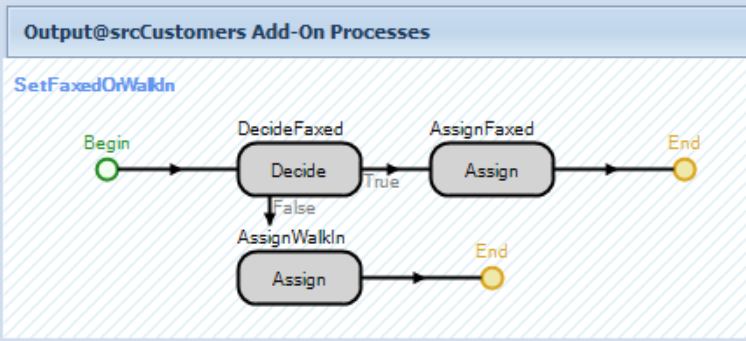

This variable is used to determine the path of customers.  All customers first go to the cashier, the output node of the cashier has two connectors: one leading to the pharmacist for walk-in customers, and one leading to the sink for fax-ahead customers.  This logic is implemented by setting the selection weight of both connectors to `ModelEntity.IsFaxed`; this means those faxed simply leave, while those not faxed must go to the pharmacist.

This model makes some simplifying assumptions:

  - Each customer (and therefore each fax) is only filling one prescription at a time
  - There is no time for transportation of faxed-in prescriptions to the cashier

A more advanced model may incorporate varying numbers of prescriptions, as well as adding a step to match entities of multiple types (prescriptions and customers).

\newpage
An experiment of 500 replications, each running from 8:00 AM to 10:00 PM, is established with the following measures:

  - T_fax = `Fax.Population.TimeInSystem.Average`
  - TIS = `Customer.Population.TimeInSystem.Average`
  - r_c = `Cashier.Capacity.ScheduledUtilization`
  - r_p = `Pharmacist.Capacity.ScheduledUtilization`

The results of this experiment are visualized below:

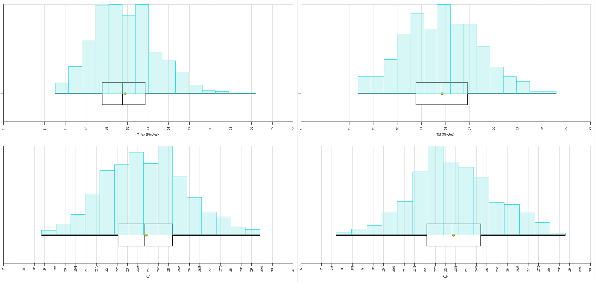

The mean time for faced prescriptions to be filled by the pharmacist is 17.71 minutes; the average total time in the system for customers is 23.57.  The utilization of the cashier and pharmacist are 23.91% and 23.39%, respectively.
