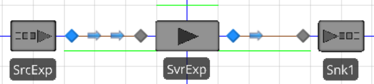
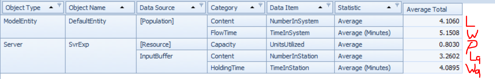

### Problem Setup
For an $M/M/1$ queue with mean interarrival time of 1.25 minutes and mean service time of 1 minute, $\lambda = 1/1.25 = 0.8$ arrivals per minute and $\mu = 1/E(S) = 1/1 = 1$ service per minute.

### Mathematical Solution
Using the equations provided in the text,
$$\rho = \frac{\lambda}{c \mu} = \frac{0.8}{1 \times 1} = 0.8$$

The utilization is 0.8 -- the single server is occupied 80% of the time.

$$L = \frac{\rho}{1 - \rho} = \frac{0.8}{1 - 0.8} = 4$$

For the steady-state system, the time weighted average number of entities in the system is 4.

$$W = \frac{L}{\lambda} = \frac{4}{0.8} = 5$$

The average time in the system is 5 minutes.

$$W_q = W - \frac{1}{\mu} = 5 - \frac{1}{1} = 4$$

The average time in the queue is 4 minutes.

$$L_q = \lambda W_q = 0.8 \times 4 = 3.2$$

There are an average of 3.2 entities in the queue.

\newpage{}
### Simulation Solution
The below model was created

with the following parameters (using minutes as the time unit):

  - SrcExp:
    - Arrival Logic: Interarrival Time
    - Interarrival Time: `Random.Exponential(1.25)`
  - SvrExp:
    - Initial Capacity: 1
    - Ranking Rule: First In First Out
    - Processing Time: `Random.Exponential(1)`
    
The results of a simulation of 240 hours produced the following results; the screenshot indicates which simulated value corresponds to which calculated value:

These results are quite similar to the mathematical results calculated above.
