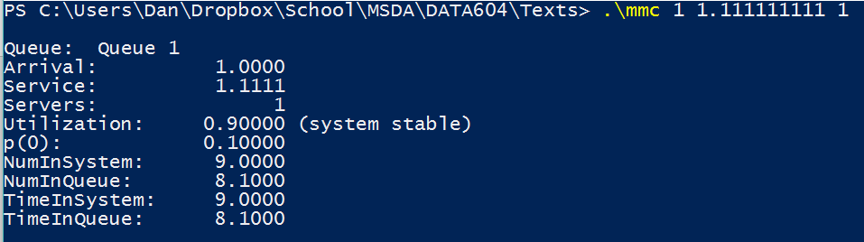
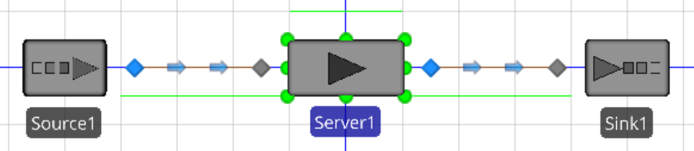
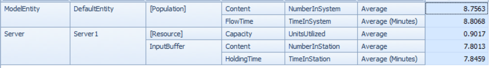

# Section 14.10, Problem 14a

## Mathematical Solution
Given $\lambda = 1$, $\mu = 1/0.9 \approx 1.11$, and $c = 1$
$$\rho = \frac{\lambda}{c\mu} = \frac{1}{1\times 1/0.9} = 0.9$$

For an $M/M/1$ system,
$$L = \frac{\rho}{1 - \rho} = \frac{0.9}{1 - 0.9} = 9$$
Using Little's Law,
$$W = \frac{L}{\lambda} = \frac{9}{1} = 9$$
$$W_q = W - \frac{1}{E(S)} = W - \mu = 9 - 0.9 = 8.1$$
$$L_q = \lambda W_q = 1 \times 8.1 = 8.1$$

These results can be confirmed using `mmc.exe`:

These figures indicate the following:

  - The server is occupied 90% of the time
  - The average number of entities in the system is 9
  - The average time in the system is 9 minutes
  - The average time in the queue is 8.1 minutes
  - The average number of entities in the queue is 8.1

\newpage
## Simio Solution

A one-source, one-server system is set up as shown below:

The source processing time is `Random.Exponential(1)` and the server processing time is `Random.Exponential(0.9)`.

The results following a 10-day simulation are below:

These results align fairly well with the mathematical results:

  - The average server UnitsUtilized of 0.9017 is quite close to $\rho = 0.9$
  - The average model NumberInSystem of 8.7563 is resonably close to $L = 9$
  - The average model TimeInSystem of 8.8068 is reasonable close to $W = 9$
  - The server TimeInStation of 7.8459 is close to $W_q = 8.1$
  - The server NumberInStation of 7.8013 is close to $L_q = 8.1$
